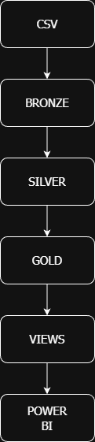
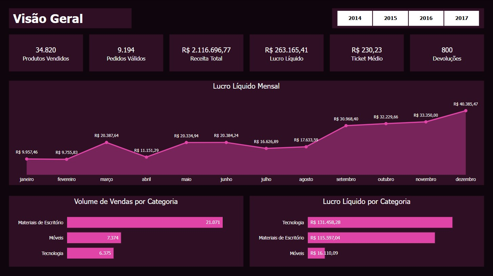
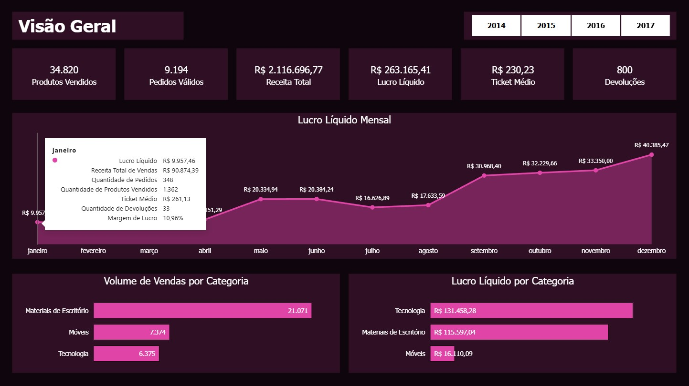
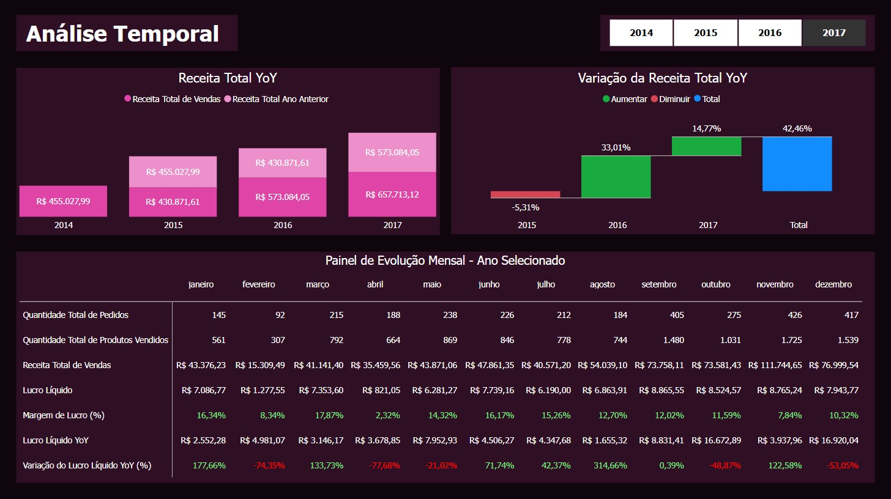
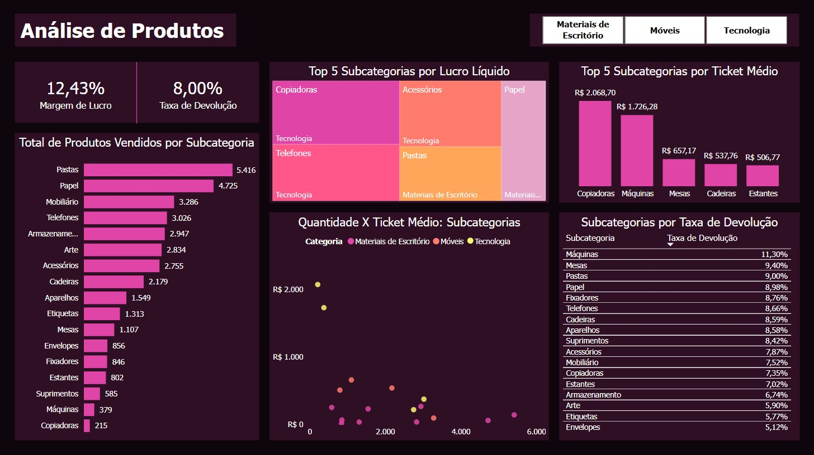

# Superstore Sales Analysis

## 1. Visão Geral do Projeto

### Contexto do Dataset

O dataset utilizado neste projeto é o "Superstore Sales", disponibilizado no Tableau Public, bastante utilizado para fins educacionais e demonstração de análise de dados. O dataset original se refere a um e-commerce, e conta com 21 colunas e 9.994 linhas. Seus dados são dos tipos: pedidos, clientes, produtos, localidades e devoluções. Os dados foram inseridos no banco de dados através de arquivos CSV.

### Objetivo do Projeto

Este projeto de análise de dados da Superstore Sales tem por objetivo assegurar a qualidade e a consistência dos dados, por meio da aplicação da arquitetura "Medallion Architecture". Após processos que garantem a qualidade dos dados, o projeto foca no desenvolvimento e construção de seu modelo dimensional, adotando o Star Schema, com constraints bem definidas, tornando os dados prontos para consumo em análises SQL e Power BI. 

### O que este Projeto demonstra

O atual projeto demonstra a aplicação das seguintes habilidades:

- Capacidade de estruturação de pipelines analíticos
- Medallion Architecture
- Tomada de decisão sobre qualidade de dados
- Validação pós-carga
- Modelagem dimensional para BI
- Definição de Constraints e Índices
- Views para consumo analítico
- Integração entre SQL e Power BI

## 2. Tecnologias Utilizadas

- PostgreSQL: Banco de dados relacional utilizado durante todas as etapas do projeto: ingestão, tratamento, modelagem e análise de dados.
- VSCode: Ambiente de desenvolvimento, conectado ao PostgreSQL via extensão.
- SQL: Linguagem utilizada para profiling, validação, modelagem dimensional e criação de views analíticas.
- Git/GitHub: Versionamento do código SQL e documentação do projeto.
- Power BI: Ferramenta de visualização utilizada para consumo analítico e construção dos dashboards finais do projeto.

## 3. Arquitetura do Projeto

### 3.1 Arquitetura

O projeto segue a Medallion Architecture, organizando os dados por camadas, com níveis distintos de refinamento, desde os dados brutos até o consumo analítico final.

### 3.2 Fluxo

O fluxo de dados do projeto ocorre na seguinte ordem:
Bronze -> Silver -> Gold -> Views Analíticas -> Power BI

### 3.3 Diagrama da Arquitetura



O diagrama acima representa o fluxo completo dos dados neste projeto.

## 4. Preparação e Qualidade dos Dados (Camadas Bronze & Silver)

### 4.1 Preparação (Camada Bronze)

A camada Bronze recebe os dados brutos, carregados diretamente a partir dos arquivos CSV. Nenhuma alteração estrutural ou de conteúdo é executada nessa camada, sendo ela responsável por armazenar os dados exatamente da maneira como chegaram do dataset, para fins de rastreabilidade e auditoria. Os dados nessa camada foram definidos como tipo TEXT, para garantir que não ocorram erros ou perdas de informação na ingestão.

### 4.2 Qualidade dos Dados (Camada Silver)

A camada Silver é dedicada ao tratamento e validação de dados. Nessa etapa foi realizado o Data Profiling, uma análise exploratória que objetiva encontrar inconsistências, duplicidades ou qualquer padrão que impactasse na tipagem e modelagem dimensional dos dados. Considerando a resposta positiva ao Data Profiling e a reputação do dataset de ser bastante limpo e indicado para estudos, optou-se por não remover ou corrigir registros, e as tabelas Silver foram criadas com a tipagem correta de dados. As justificativas de decisões de qualidade de dados, bem como as regras de qualidade aplicadas, podem ser revisadas no documento 'dq_rules.md'.

### 4.3 Avaliação da Tabela 'silver_people'

Durante o Data Profiling, a tabela 'silver_people', que contém nomes de gerentes e suas respectivas regiões de responsabilidade, foi analisada, e optou-se por não utilizá-la no modelo analítico, visto que a tabela não está diretamente relacionada ao grão da fato, e resultaria na necessidade de alterar o esquema do modelo dimensional para Snowflake, aumentando a complexidade do projeto sem trazer benefício analítico justificável.

## 5. Modelo Analítico (Camada Gold)

### 5.1 Modelagem Dimensional (Camada Gold)

Camada voltada ao consumo analítico. Nela os dados foram modelados dimensionalmente, tendo sido optado o Star Schema, visando facilitar análises e a integração com o Power BI. No modelo dimensional, foram definidas as tabelas fato e dimensões, as chaves primárias (PK) e estrangeiras (FK), as constraints e os índices, com o objetivo de aprimorar a performance das consultas e alinhar o projeto a cenários de análise de negócios.

### 5.2 Tabela Fato

A tabela fato foi criada mantendo o grão do dataset original, identificado no Data Profiling, que é order line, ou seja, linhas de item de pedido. Cada linha representa um item dentro de um pedido. A tabela contém as métricas (quantity, sales, discount, profit), as chaves estrangeiras que se conectam às dimensões (product_id, customer_id, geography_id, order_date_id, ship_date_id), uma chave primária artificial (fato_sales_id), uma degenerate dimension (order_id), uma coluna descritiva (ship_mode - optou-se por manter essa coluna na tabela fato para não criar uma dimensão contendo apenas essa coluna, o que mantém boa organização sem prejuízo analítico) e uma flag (returned_flag - derivada da tabela returns).

### 5.3 Tabelas Dimensão

Colunas descritivas foram utilizadas para criar tabelas de dimensões: produtos, clientes, geografia e data. Essas tabelas recebem valores distintos, e portanto têm seus grãos alterados:

- Dimensão Produtos: Grão de 1 produto por linha.
- Dimensão Clientes: Grão de 1 cliente por linha.
- Dimensão Geografia: Grão de 1 localidade por linha.
- Dimensão Data: Grão de 1 data por linha.

As dimensões serão utilizadas analiticamente em SQL e dentro do Power BI, em conjunto com as métricas da tabela fato.

## 6. Views Analíticas

A partir da camada Gold, foram criadas views analíticas, separadas nas categorias 'view base' e 'views complementares'. O objetivo da view base ('vw_sales_analytics') é servir como base para o Power BI, contendo todos os campos analíticos e descritivos sem agregações. As views complementares, por sua vez, serviram como forma de padronizar métricas e KPIs. Posteriormente, a view 'vw_geo_analytics' passou a compor o grupo de views na Camada Gold, com o intuito de servir como consumo para o Power BI, para criação de análises geográficas específicas.

## 7. Visualizações e Análises (Power BI)

### 7.1 Objetivo da Camada de Visualização

O objetivo da Camada de Visualização é transformar os dados tratados e validados na Camada Gold em informações analíticas interativas, que auxiliam à tomada de decisão por meio de dashboards no Power BI.

### 7.2 Modelagem no Power BI

O modelo analítico no Power BI foi construído a partir de views estruturadas na Camada Gold do banco de dados, onde toda a modelagem dimensional (tabela fato e tabelas dimensão) foi previamente implementada em SQL.

A principal fonte de dados do dashboard no Power BI é a view 'vw_sales_analytics', que consolida as métricas da tabela fato junto com todas as colunas descritivas das tabelas dimensão (customers, date, geography e products). Dessa forma, o Power BI consome uma tabela analítica já pronta para uso.

Dentro do Power BI, a única relação adicional criada foi entre a view 'vw_sales_analytics', colunas order_date (ativa) e ship_date (inativa) e a tabela calendário 'dim_calendario', construída no própria Power BI, com o intuito de permitir o uso de funções de inteligência de tempo. A 'dim_calendario' foi criada em linguagem M, e apresenta o seguinte código:
```powerquery
let
/* Criando Variáveis */
Tabela1 = List.Buffer(Sales_Analytics[order_date]),
MinDate = List.Min(Tabela1),
MaxDate = List.Max(Tabela1),
MaxYear = Date.Year(MaxDate),
MinYear = Date.Year(MinDate),
InitialDate = #date(MinYear, 1, 1),
EndDate = #date(MaxYear, 12, 31),
Duration = Duration.Days(EndDate - InitialDate) +1,

    Fonte = List.Dates(InitialDate, Duration, #duration(1, 0, 0, 0)),
    #"Convertido para Tabela" = Table.FromList(Fonte, Splitter.SplitByNothing(), null, null, ExtraValues.Error),
    #"Colunas Renomeadas" = Table.RenameColumns(#"Convertido para Tabela",{{"Column1", "Data"}}),
    #"Ano Inserido" = Table.AddColumn(#"Colunas Renomeadas", "Ano", each Date.Year([Data]), Int64.Type),
    #"Nome do Mês Inserido" = Table.AddColumn(#"Ano Inserido", "Nome do Mês", each Date.MonthName([Data]), type text),
    #"Mês Inserido" = Table.AddColumn(#"Nome do Mês Inserido", "Mês", each Date.Month([Data]), Int64.Type),
    #"Dia Inserido" = Table.AddColumn(#"Mês Inserido", "Dia", each Date.Day([Data]), Int64.Type),
    #"Nome do Dia Inserido" = Table.AddColumn(#"Dia Inserido", "Nome do Dia", each Date.DayOfWeekName([Data]), type text),
    #"Trimestre Inserido" = Table.AddColumn(#"Nome do Dia Inserido", "Trimestre", each Date.QuarterOfYear([Data]), Int64.Type),
    #"Prefixo Inserido" = Table.AddColumn(#"Trimestre Inserido", "Prefixo", each "T" & Text.From([Trimestre], "pt-BR"), type text),
    #"Colunas Removidas" = Table.RemoveColumns(#"Prefixo Inserido",{"Trimestre"}),
    #"Colunas Renomeadas1" = Table.RenameColumns(#"Colunas Removidas",{{"Prefixo", "Trimestre"}}),
    #"Coluna Personalizada Adicionada" = Table.AddColumn(#"Colunas Renomeadas1", "Personalizar", each Text.Combine({Text.Start([Nome do Mês], 3), "/", Text.From([Ano], "pt-BR")}), type text),
    #"Colunas Renomeadas2" = Table.RenameColumns(#"Coluna Personalizada Adicionada",{{"Personalizar", "Mês Abreviado"}}),
    #"Coluna Personalizada Adicionada1" = Table.AddColumn(#"Colunas Renomeadas2", "Personalizar", each Text.Combine({Date.ToText([Data], "yyyy"), Date.ToText([Data], "MM")}), type text),
    #"Tipo Alterado" = Table.TransformColumnTypes(#"Coluna Personalizada Adicionada1",{{"Data", type date}}),
    #"Colunas Renomeadas3" = Table.RenameColumns(#"Tipo Alterado",{{"Personalizar", "Ano Mês Num"}})
in
    #"Colunas Renomeadas3"
```

Além da view principal, foi carregada no Power BI a view 'vw_geo_analytics', criada em SQL, contendo agregações por estado e classificação de resultado econômico com CASE WHEN. Essa view é utilizada exclusivamente no mapa "Resultado Econômico por Estado - Visão Geral e Histórica" da página de Análise Geográfica no dashboard, e não se relaciona com as demais tabelas do modelo, pois representa uma agregação em grão específico.

As medidas DAX foram armazenadas em uma espécie de tabela, denominada "Medidas". Nesta tabela, só existem as medidas DAX, que calculam métricas do negócio.

### 7.3 Medidas Criadas

Medidas DAX foram criadas no Power BI para o cálculo das principais métricas do negócio. São elas:

- Receita Total de Vendas
- Quantidade Total de Produtos Vendidos
- Quantidade Total de Pedidos Válidos
- Lucro Líquido
- Ticket Médio
- Quantidade Total de Devoluções
- Receita Total do Ano Anterior
- Receita Total Year over Year
- Receita Total Year over Year (%)
- Lucro Líquido do Ano Anterior
- Lucro Líquido Year over Year
- Lucro Líquido Year over Year (%)
- Desconto Total
- Taxa de Devolução (%)
- Quantidade Total de Pedidos
- Receita por Subcategoria (%)
- Receita por Categoria (%)
- Margem de Lucro (%)
- AUX Cor Card Lucro Estado

Essas medidas servem para que os visuais possam se ajustar automaticamente às segmentações aplicadas, o que assegura a consistência dos indicadores em diferentes contextos analíticos.

### 7.4 Estrutura das Páginas do Dashboard

**Página 1 - Visão Geral**



A Visão Geral apresenta os principais indicadores de desempenho comercial do período analisado, e permite a compreensão da situação econômica e operacional do negócio.

No topo da página há uma segmentação de dados por ano (range 2014-2017), que permite filtrar todos os visuais da página, permitindo análises temporais específicas.

**Principais Indicadores**
Os principais indicadores da Visão Geral estão divididos em seis cartões de proporções iguais, e apresentam as seguintes métricas agregadas do período selecionado:

- Quantidade Total de Produtos Vendidos 
- Quantidade Total de Pedidos Válidos
- Receita Total de Vendas
- Lucro Líquido
- Ticket Médio
- Quantidade Total de Devoluções

Os valores dos cartões Receita Total, Lucro Líquido e Ticket Médio são formatados em Real Brasileiro (R$) e todos os cards utilizam separador de milhar quando aplicável.

> Decisão Analítica: O Lucro Líquido foi adotado como principal métrica financeira, pois, embora o dataset não tenha claro todos os valores referentes aos custos do negócio, o dataset contém a coluna 'profit' que se refere ao lucro líquido já calculado, e essa métrica permite uma análise mais realista de rentabilidade que a receita total, por exemplo.

**Evolução Mensal do Lucro Líquido**
O gráfico de linhas "Lucro Líquido Mensal" apresenta a evolução do lucro líquido mês à mês (janeiro-dezembro), podendo ser filtrado pela segmentação por ano, permitindo análises de sazonalidade e análises de tendências. Os tooltips deste gráfico incluem:

- Lucro Líquido
- Receita Total de Vendas
- Quantidade Total de Pedidos Válidos
- Quantidade Total de Produtos Vendidos
- Ticket Médio 
- Quantidade Total de Devoluções
- Margem de Lucro (Valor percentual)

Os tooltips servem, para este gráfico, para permitir uma análise contextual sem a necessidade de trocar de visual.



**Desempenho por Categorias de Produtos**
O desempenho por categorias de produtos é dividido em dois gráficos distintos:

- Volume de Vendas por Categoria
- Lucro Líquido por Categoria

Ambos os gráficos utilizam os seguintes tooltips:

- Quantidade Total de Produtos Vendidos
- Receita Total de Vendas
- Lucro Líquido
- Margem de Lucro (Valor percentual)
- Taxa de Devolução (Valor percentual)

> Decisão de Design: Ambos os gráficos utilizam os mesmos tooltips. Essa padronização se deu para que seja possível fazer uma comparação direta entre volume e rentabilidade da mesma categoria sem a necessidade de alternar entre os visuais. 

**Página 2 - Análise Temporal**



A Análise Temporal explora a evolução do desempenho do negócio ao longo dos anos, e permite identificar tendências de crescimento e variações de desempenho entre diferentes períodos.

No topo da página, há uma segmentação de dados por ano, utilizada para controlar o painel de evolução mensal (matriz). A seleção única é obrigatória nesta segmentação, para fins de consistência de informações.

**Comparativo Anual - Year over Year (YoY)**
Dois gráficos apresentam a comparação anual:

- Receita Total YoY: Gráfico de colunas empilhadas que compara a receita total de cada ano com a receita total do ano anterior. Os tooltips exibem o ano e a receita total de vendas e lucro líquido do exercício corrente e do exercício anterior.
- Variação da Receita Total YoY (%): Gráfico de cascata mostrando a variação percentual da receita total de vendas ano a ano. As cores, neste visual, seguem padrão semântico (verde para positivo, vermelho para negativo e azul para totais).

> Decisão Analítica: Os dois gráficos YoY não se relacionam com a segmentação por ano do topo da página, pois já são visuais que apresentam dados referentes à todo o período disponível.

**Painel de Evolução Mensal**
A matriz "Painel de Evolução Mensal - Ano Selecionado" exibe o detalhamento mês a mês para o ano selecionado na segmentação de datas do topo da página. As colunas da matriz representam o nome de todos os meses do ano, e as linhas incluem os seguintes indicadores:

- Quantidade Total de Pedidos Válidos
- Quantidade Total de Produtos Vendidos
- Receita Total de Vendas
- Lucro Líquido
- Margem de Lucro (Valor percentual)
- Lucro Líquido YoY
- Variação do Lucro Líquido YoY (Valor percentual)

> Decisão de Design: A segmentação por ano utiliza seleção única obrigatória, pois sem um ano selecionado, as métricas YoY presentes no painel de evolução mensal poderiam induzir à interpretações incorretas. A seleção única assegura que a comparação mensal para métricas YoY ocorra de forma coerente.

**Página 3 - Análise de Produtos**



A Análise de Produtos explora o desempenho das subcategorias de cada categoria de produtos existente no negócio, e permite identificar padrões de volume de vendas, rentabilidade, ticket médio, relação quantidade x ticket médio e comportamento das devoluções de produtos.

No topo da página há uma segmentação de dados por categorias de produtos, que permite filtrar todos os visuais da página entre as categorias Materiais de Escritório, Móveis e Tecnologia.

**Indicadores Gerais da Categoria Selecionada**
Dois cards apresentam métricas-chave da categoria filtrada pela segmentação do topo da página:

- Margem de Lucro (Valor percentual)
- Taxa de Devolução (Valor percentual)

**Ranking de Subcategorias**
Dois gráficos classificam as subcategorias de acordo com métricas específicas:

- Top 5 Subcategorias por Lucro Líquido
- Top 5 Subcategorias por Ticket Médio

O Treemap "Top 5 Subcategorias por Lucro Líquido" apresenta as cinco subcategorias mais rentáveis. Os tooltips exibem a Subcategoria, a Categoria, o Lucro Líquido, a Receita Total de Vendas e a Margem de Lucro (valor percentual).

> Decisão Analítica: Subcategorias com lucro líquido negativo não aparecem no treemap, por padrão do próprio visual. Essas subcategorias permanecem presentes nos demais gráficos da página, garantindo a representação total de todas as subcategorias existentes no portfólio de produtos do negócio.

O gráfico de colunas "Top 5 Subcategorias por Ticket Médio" apresenta as cinco categorias com maior valor médio por pedido. Os tooltips exibem o Ticket Médio, a Quantidade de Produtos Vendidos, a Receita Total de Vendas, o Lucro Líquido e a Margem de Lucro (valor percentual).

[Top 5 Subcategorias por Ticket Médio - Tooltips](../power_bi/screenshots/tooltip_top5_ticket_medio.png)

**Distribuição de Vendas das Subcategorias**
O gráfico de barras "Total de Produtos Vendidos por Subcategoria" apresenta o volume total de vendas em cada subcategoria e contempla todas as subcategorias existentes, podendo ser filtrado por categorias específicas usando a segmentação de dados do topo da página, assim como qualquer visual desta página. Os tooltips incluem:

- Quantidade Total de Produtos Vendidos
- Receita Total de Vendas
- Desconto Total
- Lucro Líquido
- Margem de Lucro (Valor percentual)
- Ticket Médio
- Taxa de Devolução (Valor percentual)
- Percentual da Receita Total de Vendas

**Relação Quantidade x Ticket Médio de Vendas por Subcategoria**
O gráfico de dispersão "Quantidade x Ticket Médio - Subcategorias" traz a análise da relação entre o volume de vendas e o valor médio dos pedidos por cada subcategoria. O gráfico classifica os pontos (subcategorias no gráfico) em categorias, e a diferença é evidenciada pela cor de cada ponto no gráfico. Os tooltips exibem a Subcategoria, a Categoria, a Quantidade Total de Produtos Vendidos, o Ticket Médio, a Receita Total de Vendas, o Lucro Líquido e a Margem de Lucro (valor percentual).

**Devoluções de Produtos**
A tabela "Subcategorias por Taxa de Devolução" apresenta a taxa de devoluções para cada subcategoria do catálogo, e permite identificar os produtos com maior e menor taxa de retorno.

> Decisão de Design: Todos os visuais da página respondem à segmentação por categoria, o que permite a análise do comportamento de cada subcategoria distinta dentro de cada categoria.

**Página 4 - Análise Geográfica**

[Página 4 - Análise Geográfica](../power_bi/screenshots/pagina_4_analise_geografica.png)

A Análise Geográfica estuda o desempenho econômico sob viés geográfico, e permite analisar o resultado do negócio à nível de Estados e de Cidades. Diferente das demais páginas, a Análise Geográfica não apresenta uma segmentação no topo da página, visto que a mesma se encontra no canto inferior esquerdo, porque não interage com alguns visuais da página.

**Visão Geral por Estado**
Dois cards apresentam o mesmo indicador:

- Lucro Líquido Total
- Lucro Líquido por Estado

Entretanto, o primeiro apresenta o valor do Lucro Líquido Total, sem nenhum filtro. O segundo apresenta o mesmo valor, filtrado pela segmentação por Estados.

Ainda no mesmo tópico, o mapa "Resultado Econômico por Estado - Visão Geral e Histórica" apresenta todos os estados com registros na base de dados, coloridos por faixas de resultado econômico, como:

- Prejuízo
- Lucro <= R$5.000
- Lucro <= R$15.000
- Lucro > R$15.001

Os tooltips exibem Estado, Resultado Econômico, Receita Total de Vendas, Lucro Líquido e Quantidade Total de Pedidos Válidos, para auxiliar na leitura do desempenho de cada estado.

> Decisão Técnica: O mapa "Resultado Econômico por Estado - Visão Geral e Histórica" é alimentado pela view 'vw_geo_analytics', criada na Camada Gold (gold_views.sql), e que contém métricas agregadas por estado e a classificação econômica calculada em SQL, com a função CASE WHEN. É uma maneira de demonstrar construção de visões temáticas agregadas no pipeline de dados. O mapa funcionaria igualmente sem a criação da view 'vw_geo_analytics', usando somente medidas DAX e colunas descritivas da view geral, usada no resto do projeto. 

**Análise por Cidades**
A segmentação de dados intitulada "Selecione o Estado", permite a seleção de um dos estados de atuação do negócio. Esta segmentação interage com o card "Lucro Líquido por Estado", com o mapa "Lucro Líquido por Cidade - Estado Selecionado" e também com a tabela "Top 10 Cidades por Lucro Líquido".

> Decisão de Design: A segmentação de dados por Estado não interage com o Card "Lucro Líquido Total" e com o mapa "Resultado Econômico por Estado - Visão Geral e Histórica" por que se tratam de visuais que informam totais e dados gerais, para fins de comparação e também de visão geral. A segmentação é também configurada para seleção única obrigatória, sendo necessário sempre escolher um estado específico, o que garante contexto consistente nos visuais dependentes e evita interpretações ambíguas.

O mapa "Lucro Líquido por Cidade - Estado Selecionado" foca o estado selecionado na segmentação de dados, e cria bolhas para todas as cidades com registros de vendas, determinando o tamanho da bolha a partir do montante de lucro líquido arrecadado pela cidade. Quanto maior o lucro da cidade, maior a bolha. O mapa permite visualizar quais cidades de cada estado tem o melhor desempenho. Os tooltips do mapa exibem Localização, Lucro Líquido, Margem de Lucro, Receita Total de Vendas, Quantidade de Pedidos, Quantidade de Produtos Vendidos e Ticket Médio.

[Lucro Líquido por Cidade - Estado Selecionado - Tooltips](../power_bi/screenshots/tooltip_mapa_lucro_cidades.png)

> Decisão Analítica: A análise geográfica foi estruturada em dois diferentes níveis: estados e cidades, e os visuais seguem essa ordem, o que cria uma exploração progressiva dos resultados e permitindo detalhamento local.

> Decisão Técnica: O mapa "Lucro Líquido por Cidade - Estado Selecionado" pode apresentar valores inesperados, que surgem porque duas cidades podem ter o mesmo nome em diferentes estados e em diferentes países. Para solucionar esse problema, foi criada, em SQL, a coluna 'city_state', que concatena o nome da cidade, o nome do estado, e o país 'USA', único país presente nos dados.

A tabela "Top 10 Cidades por Lucro Líquido" interage com a segmentação de dados e exibe 10 cidades com melhor desempenho do estado selecionado e age como uma legenda para o mapa "Lucro Líquido por Cidade - Estado Selecionado", trazendo os números do que pode ser visualizado no mapa.

## 8. Conclusão e Próximos Passos
A desenvolver.

